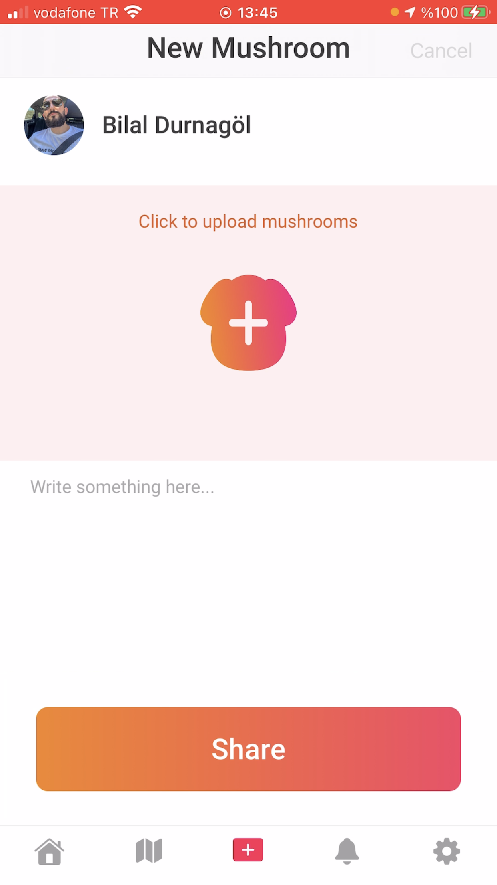
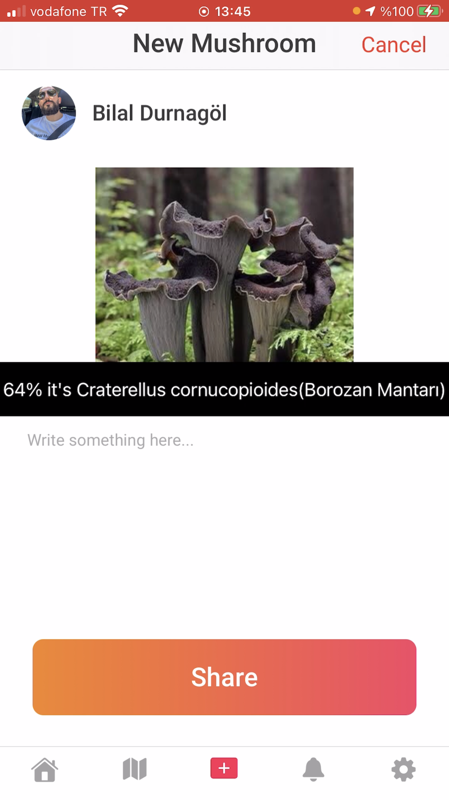
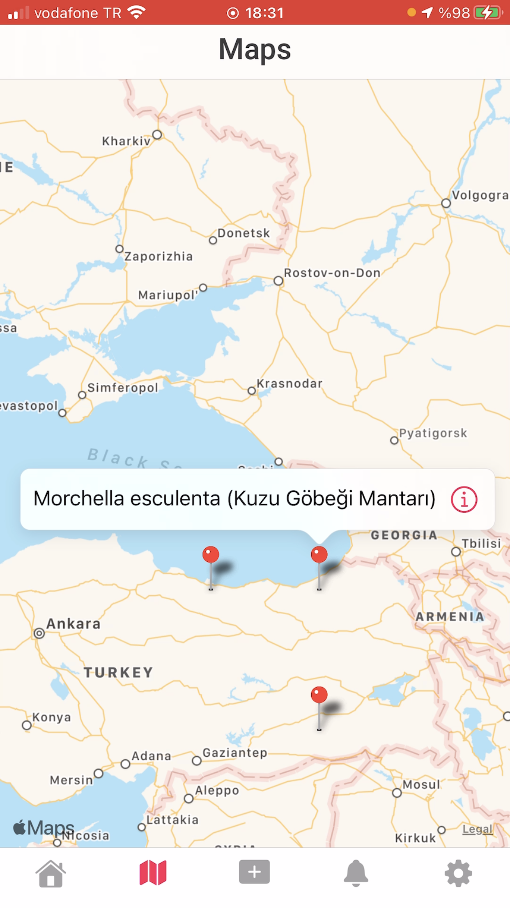

<!-- PROJECT LOGO -->
 

   

  <h3 align="center">Mushroom Finder</h3>
  
  

    I did this project to learn Vision and Core ML, which are Apple image processing and artificial intelligence libraries.
     
    <a href="https://github.com/bilaldurnagol/Mushrooms"><strong>Explore the docs »</strong></a>
     
     
    <a href="https://github.com/bilaldurnagol/Mushrooms">View Demo</a>
    ·
    <a href="https://github.com/bilaldurnagol/Mushrooms/issues">Report Bug</a>
    ·
    <a href="https://github.com/bilaldurnagol/Mushrooms/issues">Request Feature</a>
  

<!-- TABLE OF CONTENTS -->

  
Table of Contents

  <ol>
    <li>
      <a href="#about-the-project">About The Project</a>
      <ul>
        <li><a href="#built-with">Built With</a></li>
      </ul>
    </li>
    <li>
      <a href="#getting-started">Getting Started</a>
      <ul>
        <li><a href="#Requirements">Requirements</a></li>
        <li><a href="#installation">Installation</a></li>
      </ul>
    </li>
    <li><a href="#usage">Usage</a></li>
    <li><a href="#roadmap">Roadmap</a></li>
    <li><a href="#contributing">Contributing</a></li>
    <li><a href="#license">License</a></li>
    <li><a href="#contact">Contact</a></li>
  </ol>

<!-- ABOUT THE PROJECT -->
## About The Project

  This application is made for you to find the mushroom species you photographed with artificial intelligence and share it with the world.
  You can also find the location of the shared mushroom using maps and navigate to the area where the mushroom is located with the navigation feature.

   
   
     
   

Here's why:
* To learn image processing and artificial intelligence

### Built With

The frameworks I used in this project are listed below.
* CoreML
* Vision
* CoreLocation
* Alamofire

<!-- GETTING STARTED -->
## Getting Started

 This is an example of how you may give instructions on setting up your project locally. To get a local copy up and running follow these simple example steps.

### Requirements

* Xcode 12.x
* Swift 5.x

### Installation
There is no external library.

<!-- USAGE EXAMPLES -->
## Usage

<table>
  <tr>
    <th width="30%">Here's an example</th>
  </tr>
  <tr>
    <td>Get all articles...</td>
  </tr>
  <tr>
    <td>
<pre>
    
     private func recognizeImage(image: CIImage) {
        //1)request
        //2)handle
        if let model = try? VNCoreMLModel(for: Mushrooms().model) {
            let request = VNCoreMLRequest(model: model, completionHandler: {[weak self] vnRequest, error in
                guard let strongSelf = self else {return}
                if let result = vnRequest.results as? [VNClassificationObservation] {
                    if result.count > 0 {
                        let topResult = result.first
                        DispatchQueue.main.async {
                            let confidenceLevel = (topResult?.confidence ?? 0 ) * 100
                            let rounded = Int(confidenceLevel * 100) / 100
                            strongSelf.resultLabel.text = "\(rounded)% it's \(topResult!.identifier)"
                            strongSelf.resultLabel.isHidden = false
                            strongSelf.mushroomName = topResult?.identifier
                        }
                    }
                }
            })
            let handle = VNImageRequestHandler(ciImage: image)
            DispatchQueue.global(qos: .userInitiated).async {
                do {
                    try handle.perform([request])
                } catch {
                    print("failed")
                }
            }
        }
    }
  </tr>
</table>

<!-- LICENSE -->
## License

Distributed under the MIT License. See `LICENSE` for more information.

<!-- CONTACT -->
## Contact
   

   

   

   
 
 
  
Project Link: [https://github.com/bilaldurnagol/Mushrooms](https://github.com/bilaldurnagol/Mushrooms)
